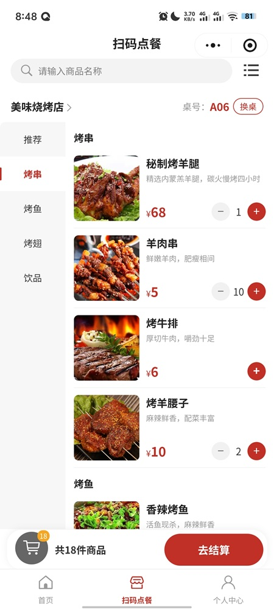
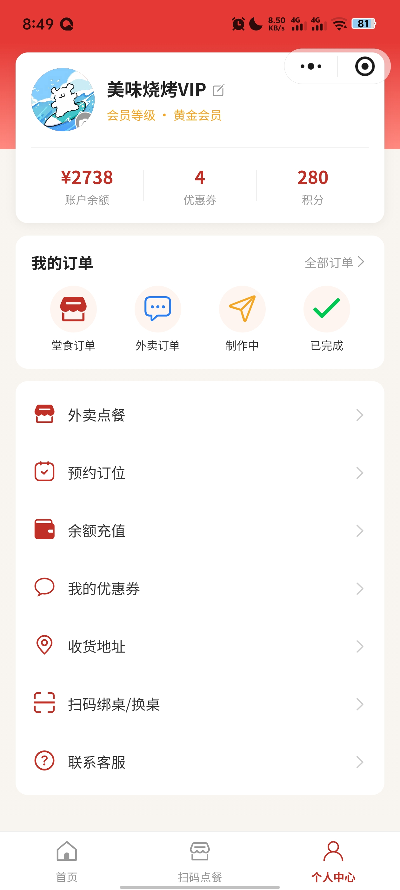
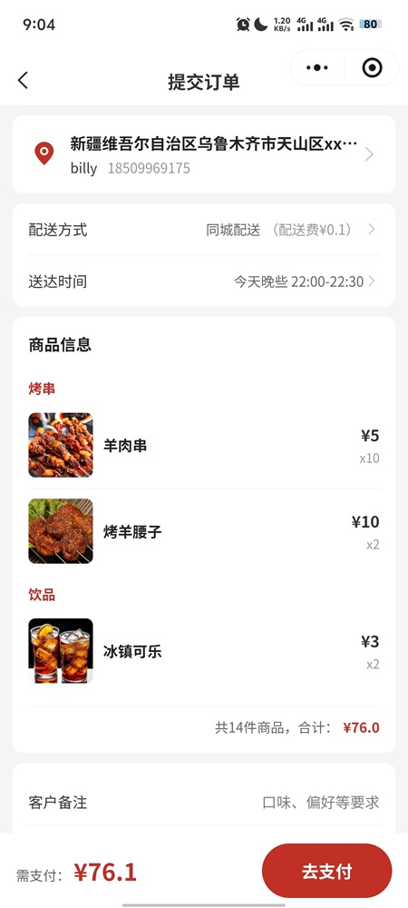
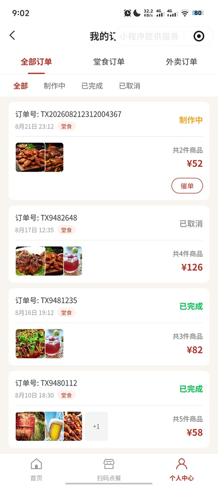

# 炭火烧烤 · 扫码点餐微信小程序

基于 **uni-app (Vue3) + uniCloud** 开发的烧烤店扫码点餐微信小程序，覆盖「堂食扫码点餐、外卖点餐、预约订位、优惠券、账户充值、订单管理、桌号管理」等完整点餐闭环。

## 项目主要截图




*提交订单页分=>自提/外卖/堂食,以上为外卖提交订单页*


## 功能特性

- **扫码点餐（堂食）**：扫码绑定桌号，按桌点餐，购物车按桌号分区独立存储
- **外卖点餐**：选择收货地址下单，配送上门
- **预约订位**：在线预约就餐时间与人数
- **优惠券**：领券、查看、下单自动匹配可用券（满减 / 折扣）
- **账户充值 / 余额明细**：预充值账户，余额消费与流水查询
- **订单中心**：订单列表、订单详情、状态流转（制作中 / 已完成 / 已取消）
- **桌号管理（商家端）**：批量生成桌台二维码、桌台列表与增删管理
- **商品管理**：分类展示、商品详情、搜索排序
- **收货地址**：地址列表与新增/编辑
- **模拟支付**：内置模拟收银台，预留 uni-pay 真实支付接入点

## 技术栈

| 分类 | 技术 |
| --- | --- |
| 框架 | uni-app（Vue3 语法） |
| 状态管理 | Pinia（按桌分区购物车） |
| 组件库 | uni-ui（easycom 自动引入） |
| 后端 | uniCloud 云函数 + 云对象 + 云数据库（支付宝服务空间） |
| 目标平台 | 微信小程序（`mp-weixin`） |

## 目录结构

```
bbq-order-wxmp/
├── pages/                     # 页面（18 个业务页面）
│   ├── index/                 # 首页
│   ├── menu/                  # 扫码点餐（菜单 + 购物车）
│   ├── table/                 # 扫码绑桌
│   ├── takeout/               # 外卖点餐
│   ├── reserve/               # 预约订位
│   ├── confirm-order/         # 确认订单
│   ├── order-list/            # 我的订单
│   ├── order-detail/          # 订单详情
│   ├── profile/               # 个人中心
│   ├── topup/                 # 账户充值
│   ├── balance-history/       # 余额明细
│   ├── coupon/                # 我的优惠券
│   ├── shop/                  # 店铺详情
│   ├── address/               # 收货地址
│   ├── address-edit/          # 编辑地址
│   ├── goods-detail/          # 商品详情
│   └── table-manage/          # 桌号管理（商家端）
├── components/                # 自定义组件
│   ├── bbq-navbar/            # 自定义导航栏
│   ├── bbq-tabbar/            # 自定义底部 Tab
│   └── goods-card/            # 商品卡片
├── common/                    # 公共模块
│   ├── config.js              # 全局配置（USE_CLOUD 开关）
│   ├── api.js                 # 统一数据访问出口
│   ├── api-cloud.js           # 云服务数据访问层
│   ├── api-mock.js            # 本地模拟数据访问层
│   ├── payment.js             # 支付抽象层
│   ├── scan.js                # 扫码结果解析工具
│   └── mock/data.js           # 本地模拟数据
├── stores/
│   └── cart.js                # 购物车 Pinia store（按桌分区）
├── uniCloud-alipay/           # uniCloud 云开发目录
│   ├── cloudfunctions/        # 云函数 / 云对象
│   └── database/              # 数据表 schema 与初始化数据
├── uni_modules/               # uni-ui 组件库
├── static/                    # 静态资源
├── pages.json                 # 页面路由配置
├── manifest.json              # 应用配置（小程序 appid、uniCloud 等）
└── main.js                    # 应用入口
```

## 环境准备

- [HBuilderX](https://www.dcloud.io/hbuilderx.html)（建议使用最新正式版）
- 微信开发者工具
- uniCloud 服务空间（支付宝云）

## 快速开始

1. 使用 HBuilderX 打开项目根目录。
2. 若未绑定 uniCloud 服务空间，请右键 `uniCloud-alipay` 目录 →「关联云服务空间」，选择你的支付宝云空间。
3. 右键 `uniCloud-alipay` →「上传所有云函数、公共模块及actions」，完成云函数部署。
4. 在 `uniCloud-alipay/database` 下执行初始化（上传 `db_init.json`，导入数据表结构与初始化数据）。
5. 在「运行」中选择「运行到小程序模拟器 → 微信开发者工具」，即可预览。

> 说明：`manifest.example.json` 为脱敏模板，`manifest.json` 中的 `uniCloud.clientSecret` 需根据实际云空间替换。

## 数据层：云端 / 本地切换

项目通过 `common/config.js` 中的 `USE_CLOUD` 开关在「云端数据」与「本地模拟数据」之间切换，页面代码零改动。

```js
// common/config.js
export const USE_CLOUD = true   // true: 使用 uniCloud 云函数 + 云数据库；false: 纯前端本地模拟数据
```

- **`USE_CLOUD = false`**：开发/调试阶段使用，无需关联云空间即可运行，数据来自 `common/mock/data.js`。
- **`USE_CLOUD = true`**：上线阶段使用，数据来自 uniCloud 云函数与云数据库。

页面统一通过 `common/api.js` 读取数据，不关心数据来源。

### 云函数清单

`uniCloud-alipay/cloudfunctions/` 下共 12 个云函数 / 云对象：

| 云函数 | 说明 |
| --- | --- |
| getCategoryList | 获取商品分类 |
| getGoods | 获取全部商品 |
| getGoodsByCategory | 按分类获取商品 |
| getTableInfo | 桌号信息（扫码绑桌） |
| createOrder | 创建订单 |
| getOrderList | 获取订单列表 |
| updateOrderStatus | 更新订单状态 |
| getCoupons / getCouponCount / getAvailableCoupons / useCoupon | 优惠券相关 |
| tableQrManager（云对象） | 桌号管理：批量生成二维码、桌台列表、删除等 |

### 数据表

`uniCloud-alipay/database/` 下包含 `category`、`goods`、`order`、`coupon`、`table` 五张表的 schema、扩展校验函数（.ext.js）与初始化数据（init_data.json）。

## 购物车设计

- 使用 Pinia 管理，购物车按「桌号」分区，存储键为 `bbq_cart_{tableNo}`（未绑桌时为 `bbq_cart`），持久化到本地 `Storage`。
- 支持加购、增减数量、勾选/全选、备注、清空，切换桌台后自动回填对应购物车。

## 扫码解析

`common/scan.js` 兼容三种二维码来源：

1. 微信小程序码（`scene=t=A01`，需从 path 的 scene 中解析）
2. 普通二维码（内容含 `tableId=` / `t=` 参数）
3. 纯桌号文本（如 `A01`）

## 支付说明

当前为**模拟支付**：弹出模拟收银台，确认后延时返回支付成功，无需真实支付通道。

> 个人主体小程序无法开通微信支付。后续更换可支付主体后，按 `common/payment.js` 中预留的 `payWithUniPay` 接入 uni-pay 真实支付即可，页面无需改动。

## 常见问题

**1. 页面无数据？**
请确认 `USE_CLOUD` 配置：本地调试可先设为 `false` 使用模拟数据；使用云端数据需确保云函数已上传、`db_init.json` 已初始化。

**2. 如何生成桌台二维码？**
进入「桌号管理」页面（商家端），可单个或批量生成桌台二维码，由云对象 `tableQrManager` 负责生成。

**3. 支持哪些平台？**
当前主要面向微信小程序，uni-app 框架天然支持后续扩展到 App、H5 等多端。
